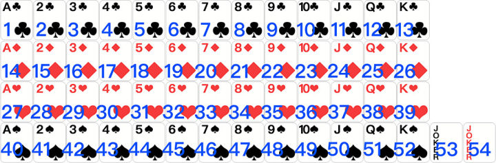

# 斗地主AI设计与实现

 [宽立斗地主](http://www.cronlygames.com/download/download.php?p=com.cronlygames.landlord) 是 [上海宽立信息技术有限公司](http://www.cronlygames.com/)出品的一款斗地主游戏，内置了基于权重的斗地主游戏AI算法。这种算法是我们过去几年在棋牌游戏上的经验体现，稍加修改，算法可以很容易的拓展到其他类似棋牌游戏上，如掼蛋，争上游，拖拉机等。本文将详细介绍从头开始，如何一步一步建立一个比较高智力的斗地主游戏算法。

This repository will talk about AI algorithms for a chinese famous card game - landlord or DouDiZhu, it is based on weights.

## 第0章、致敬BlueDJ
本人自2011年开始进入移动行业创业，开始做的是连连看，满天星等休闲小游戏，对棋牌游戏很感兴趣但一直无法入门。后来在网上找到一套开源的棋牌游戏大厅和客户端，即bluedj；经过一段时间的尝试，先在Linux平台上搭建好服务器，再花了一段时间把客户端从QT移植到iOS的ObjC下，终于踉踉跄跄开始棋牌游戏开发生涯。可以说，没有bluedj，很大可能上就没有本文的诞生。在此向 北京蓝色迪杰(BlueDJ)致敬！


## 第一章、环境初始化
为了演示斗地主算法的内容，我们需要创建好一个相关的cocos2d-x项目，并加入相关的代码，声音，图片等。与斗地主客户端对应的服务器端是基于skynet写的一个分布式游戏框架，为了代码复用方便和网络通讯需要，我们需要把lua升级到5.3，并在本地加入protobuf相关的解析库(我们使用的是pbc)。有些通用的函数库是游戏中必不可少的，我们也需要加入。

本游戏中所使用的代码遵守Apache License 2.0，可以在Apache协议规定的范围内使用。但所使用的声音图片等艺术类资源为本公司[上海宽立信息技术有限公司](www.cronlygames.com)和本文作者周为宽共同所有，可以下载学习，但请勿在商业环境下使用！

### 建立DouDiZhu项目
* 初始化项目

目前cocos2d-x的官方最新版本为3.16，可以在[cocos2d-x官网](http://www.cocos2d-x.org)上自由下载使用。按照官方使用的Readme.md或其它资料完成配置后，可以使用以下命令创建项目：

    cocos new DouDiZhu -p com.cronlygames.landlord -l lua -d projects

创建后，再把DouDiZhu这个项目的目录移动到github库DouDiZhu下，并改名为code 。为了使用和理解方便，github库DouDiZhu是放在Desktop这个目录里
    
    CronlyGames@MacBook-Pro-15 DouDiZhu $ pwd
    /Users/CronlyGames/Desktop/DouDiZhu

本目录下所有内容为:

    CronlyGames@MacBook-Pro-15 DouDiZhu $ tree -L 2
    .
    ├── LICENSE
    ├── README.md
    ├── images
    └── code
        ├── config.json
        ├── frameworks
        ├── res
        ├── runtime
        └── src

    5 directories, 3 files

其中code目录就是刚才用 cocos new 所创建DouDiZhu项目，images目录存放本文中所使用到的所有图片。
git commit 提交改动，

    commit 3787c58f9d7cb74c4d8e576e3f3947b81f3f1882 (HEAD -> chap1_environment)
    Author: Zhou Weikuan <zhouweikuan@gmail.com>
    Date:   Tue May 22 10:47:32 2018 +0800

    add the original DouDiZhu project, and rename the directory to code
    
* iOS & android 运行成功

对于iOS项目，在MacOS下点击 DouDiZhu/code/frameworks/runtime-src/proj.ios_mac/DouDiZhu.xcodeproj，编译运行即可。同时我们需要更新图标，产品名称等。
对于android项目，我们使用的是Android Studio，导入目录DouDiZhu/code/frameworks/runtime-src/proj.android-studio 。由于环境和参数不同，编译时有很多错误。根据当前环境修改gradle.build，多个properties文件和AndroidManifest.xml，更新图标等，最终保证可以编译成功，并运行在测试机器上。

此时提交改动:

    commit acc5f9ef24e4f608f22a331e8bfcbc2cb392d48f (HEAD -> chap1_environment)
    Author: Zhou Weikuan <zhouweikuan@gmail.com>
    Date:   Tue May 22 13:22:01 2018 +0800

        更改图标，产品名称，保证可以运行在iOS & android上; 使用的是Android Studio

### 升级lua到5.3

* 下载最新的lua版本

我们的服务器是基于skynet，而skynet使用的lua版本为5.3。为了更好的复用lua代码，我们需要把cocos2d-x的lua版本也升级到[lua 5.3](http://www.lua.org/ftp/lua-5.3.4.tar.gz)。在code目录下新建3rd目录，并且下载lua后解压缩src到3rd/lua目录，去掉Makefile文件。结构如下:
    
    code/3rd/lua/
        ├── lapi.c
        ├── lapi.h
        ├── lauxlib.c
        ├── lauxlib.h
        ├── ...

提交所有lua文件，

    commit 9b55634bf0b799fb014aa3f05651bd86b482e4d9 (HEAD -> chap1_environment)
    Author: Zhou Weikuan <zhouweikuan@gmail.com>
    Date:   Tue May 22 13:31:52 2018 +0800

        增加lua 5.3文件，准备修改    

* 支持 64位

为了同时兼容64位和32位操作系统，我们把ldump.c, lundump.c里的的函数DumpHeader, checkHeader中所使用到的size_t改为int。iOS新版不再支持system命令，修改loslib.c，用-1去掉system函数调用。 

* 项目里加入lua 5.3 支持   

lua升级到5.3时，参考了网友的[心得](http://yestein.com/2015/06/09/%e5%b0%86cocos2dx%e9%87%8c%e7%9a%84lua%e5%8d%87%e7%ba%a7%e8%87%b35-3/)。我们只支持iOS和android，不考虑windows，步骤更简单

1. 删除 DouDiZhu/code/frameworks/cocos2d-x/external/lua 下的 lua目录和luajit目录
2. 修改 DouDiZhu/code/frameworks/cocos2d-x/external/lua/tolua 目录下的 tolua_event.c, tolua_map.c, tolua_push.c 这三个文件；主要是uservalue和fenv之间的替换
3. 修改 code/frameworks/cocos2d-x/cocos/scripting/lua-bindings/manual目录下的 CCLuaStack.cpp, lua_extensions.c, tolua_fix.cpp 这三个文件，也是与2.类似，替换成lua 5.3的语法
4. iOS下，修改所有的项目文件，cocos2d_lua_bindingds.xcodeproj里，加入lua目录作为group，并修改所有引用到的项目文件，修改lua的User Header Search Paths，去掉luajit，并加入新版lua的相对目录；修改Preprocessor Macros，加入LUA_COMPAT_5_1, LUA_COMPAT_APIINTCASTS，并把CC_ENABLE_CHIPMUNK_INTEGRATION=1改成CC_ENABLE_CHIPMUNK_INTEGRATION=0，因为根本用不到chipmunk
5. android下，修改 DouDiZhu/code/frameworks/cocos2d-x/cocos/scripting/lua-bindings/proj.android/Android.mk 文件，主要是把之前的旧版本lua和luajit换成新版本的位置和参数；编译时通不过，需要调整若干新版本lua的文件
6. DouDiZhu/code/frameworks/cocos2d-x/plugin 这个目录基本没用，删除！ 所有Deprecated的lua文件基本没用，删除！ lua 5.3有自己的位操作，以前的bitExtend也不要了！

以上修改提交信息如下:

    commit 2778dd451e94f5ce6a825bb89c28b4538dc1e101 (HEAD -> chap1_environment)
    Author: Zhou Weikuan <zhouweikuan@gmail.com>
    Date:   Tue May 22 16:08:16 2018 +0800

        升级 lua 5.3

### 加入protobuf
客户端与服务器交互时，使用的是protobuf，版本是2.x 。首先我们需要下载Google提供的protobuf，编译安装后得到protoc命令，用来编译.proto文件到.pb 。然后在lua里支持protobuf，我们用的是pbc这个库。从github上下载pbc后，放在 code/3rd/protobuf，针对lua5.3剪裁文件。

对于iOS，需要在项目里加入protobuf整个目录；对于android，需要把所有.c文件 和.h的路径 加入Android.mk，同时把脚本文件 protobuf.lua加入build.gradle，这样编译时就会自动拷贝到assets目录。

以上修改提交后显示如下:

    commit 624d8c8f0076b307e75baca7913660d4086c8476 (HEAD -> chap1_environment)
    Author: Zhou Weikuan <zhouweikuan@gmail.com>
    Date:   Tue May 22 17:22:44 2018 +0800

        加入protobuf相关文件

### 加入游戏资源
关于资源文件，我们用的是之前运城斗地主的资源，放在res目录下，子目录有:

    all         游戏中的背景图片和本地化字符串文件
    both        TexturePacker打包后的图片文件
    eff         游戏内的spine动画效果
    gift        与其他玩家互动的礼物效果
    music       不同场合下的背景音乐
    protos      protobuf的pb文件和本地的cfg游戏相关配置文件
    sounds      声音效果，包括男女音效和触发的场合音效等
    
以上资源文件版权归属上海宽立和周为宽共同所有，可以在本地学习使用，但不得再发布，更禁止在商业环境使用；版权所有，违法必究！

### 一些公用函数库
同时，游戏里也有一些公用的库和函数，这里列出如下：

    Algos       算法和数据结构
        \ -     NumArray.lua            可以获得元素个数的数组
        \ -     NumSet.lua              可以获得元素个数的集合
        \ -     PriorityQueue.lua       有优先级的队列
        \ -     Queue.lua               先进先出的队列
        \ -     SeatArray.lua           可以获得元素个数的座位

    Helpers
        \ -     DBHelper.lua            数据库处理
        \ -     DebugHelper.lua         调试打印信息
        \ -     FilterHelper.lua        过滤
        \ -     PacketHelper.lua        protobuf处理
        \ -     StringHelper.lua        字符串处理
        \ -     TableHelper.lua         处理lua的table
        
    Classes
        \ -     GameTable.lua           棋牌游戏的通用接口
        \ -     HallInterface.lua       通用游戏大厅的接口
        \ -     ProtoTypes.lua          通用的属性定义
        \ -     RoomInterface.lua       继承自HallInterface, 棋牌类游戏大厅的实现
        \ -     Const_YunCheng.lua      运城斗地主的通用常量定义
        \ -     Table_YunCheng.lua      运城斗地主的服务器端流程处理，继承自GameTable
        
    utils
        \ -     AIPlayer.lua            本地的人物属性
        \ -     Constants.lua           常量和UI通用函数 
        \ -     Settings.lua            保存本地数据
        \ -     SoundApp.lua            声音
        \ -     YunCheng_BotPlayer.lua  客户端回调处理


### 各场景划分
对于单机斗地主，场景比较少。游戏开始时，调用MainScene.lua显示启动界面，然后自动跳转到LineScene.lua，点击游客登录后，进入GameScene.lua，开始游戏。
GameScene.lua主要是初始化游戏玩家信息，实现一个周期性tick函数来驱动游戏流程，然后在CommonLayer.lua里显示界面。
CommonLayer.lua再调用ClockLayer.lua显示时钟倒计时，PlayerInfoLayer.lua显示玩家信息，SettingLayer.lua进行设置，UIHelper.lua辅助处理，MsgBox.lua显示弹窗等。

### C/C++相关文件
同时对code/frameworks/runtime-src/Classes下增加如下文件:

    AutoLock.h/cpp                  线程锁，防止多线程重入
    LuaCall.h/cpp                   向lua中注册c/cpp库
    luaproc.h/c                     lua异步线程库，避免AI算法太耗时，锁住UI线程
    PermutationCombine.h/cpp        从N个数中选M的算法 (M <= N)
    YunChengAI.h/cpp                斗地主的AI核心算法
    LuaYunCheng.h/cpp               斗地主的游戏流程包装，供lua调用

YunChengAI和LuaYunCheng中目前为空，或者被注释，我们下一章会先写一个最简化的游戏AI，然后再优化。

### 本章总结
由于本文主要内容是介绍单机斗地主的AI实现，本章介绍的是实现AI前的环境设置，告诉读者有哪些内容，需要哪些实现，但具体的实现细节和说明比较简略，以后有时间再完善。 本章最后提交信息如下:

    commit e48fdb66d4ca16dc7bf4b3b4345f5db397560c58 (HEAD -> chap1_environment)
    Author: Zhou Weikuan <zhouweikuan@gmail.com>
    Date:   Thu Jul 19 13:41:30 2018 +0800

        第一章，前提环境介绍完成


## 第二章、实现游戏的流程
由于之前的游戏是一个整体，我分拆移植到现在的项目后，目前仍然不能通过编译，无法运行。我们在本章将逐步完善YunChengAI.h/cpp，让它通过编译；并实现一个最简单版本的AI，即每次开始新一轮出牌时，只出一张手上有的最小的牌；跟牌时，也是出那张可以打过上次出牌的最小的那张牌。也就是说，本章完成后，会有一个AI最小化的运行版本。

### 文件功能说明
HallInterface.lua 实现了一个通用的棋牌游戏、休闲游戏的大厅接口；RoomInterface.lua继承自HallInterface.lua，实现棋牌游戏大厅内桌位的管理，换桌等功能。GameTable.lua则实现一个棋牌游戏桌与用户交户和游戏时的各种接口。ProtoTypes.lua则规定了所有游戏都通用的属性定义和通讯协议。

对于斗地主游戏，我们可以不用太多关注上面的实现细节，把主要精力放在 Const_YunCheng.lua, Table_YunCheng.lua, YunCheng_BotPlayer.lua 这三个文件上面。

### Const_YunCheng.lua 
本文件是对斗地主游戏的常量定义。

1. 首先设置const的metatable，避免引用到未定义的空值；
2. 然后定义游戏的ID和版本号；
3. 再定义游戏的特殊牌值和常量，以及面值和牌型等；
4. 然后是游戏客户端服务器端相互沟通时的协议数值，游戏桌的状态和各状态的等候时间; 
5. 再后是游戏的各种出错情况定义；
6. 再后是各种辅助函数；
7. 最后是等级说明。

### Table_YunCheng.lua
本文件是游戏的服务器核心模块。

玩家在加入游戏，进入桌子，等到足够的准备好的玩家后，游戏从本文件的gameStart函数正式开始。gameStart初始化整个游戏所需要的信息，并用gametrace发送给桌上的玩家，然后进入各种不同的等候状态。再等候时，接收玩家的输入并进行相关的处理，如果等候超时，会自动按默认输入处理。处理完成后，进入下一状态。如此循环往复，最后等某个玩家所有的牌出完，游戏终止，进入yunchengGameOver函数。

本文件的主要函数如下:

1. gameStart           游戏开始，初始化数据
2. yunchengGameOver    游戏结束，处理各玩家得分
3. yunchengGameTrace   接收用户输入，并进行相关处理
4. yunchengTimeout     各状态超时，自动处理

在游戏过程中，主要分成 发牌阶段，叫地主阶段，出牌阶段，结束阶段等。

### YunCheng_BotPlayer.lua
本文件主要是客户端的通讯处理和机器人AI部分。

主要包括收发包，发包的简单包装，对接收到的信息的进行处理，再判断服务的对象，是玩家通知UI更新，是机器人进行AI处理等。

由于AI比较耗时，为了不卡顿UI，我们用luaproc另起一个线程处理AI部分。主线程每隔一段时间检查luaproc结果，有结果再继续。对luaproc包装后，必须新建一个coroutine来调用 run_long_func，然后在主线程里调用check_long_func使得coroutine可以在有结果后继续进行。

### C库到lua的接口
LuaYunCheng.h/cpp 为整个游戏流程提供了来自C++的完整AI库。包括以下几个部分

1. 环境设置类

    updateSeats     更新地主和当前玩家
    
    addHistCards    出牌历史记录
    
    setHandCards    玩家具体的手牌
    
    getHandCards
    
    setHandCount    手牌设置，只知道别人的牌数
        
2. 牌面排序调试
    
    sortMyCards         手上的牌按面值排序
    
    removeSubset        根据子集，移除那部分手牌
    
    debugSnakeInfo      可视化输出手牌信息
    
3. 叫地主辅助

    getWinPossible      做地主的胜率猜测
    
    bigEnough           手牌太大？必须做地主！
    
4. 出牌提示

    getNodeType             之前所出牌的牌型
    
    calcPowerValue          计算手上所有牌的权重
    
    canPlayCards            选择的牌可以打过之前的牌吗？
    
    getDirectPrompts        直接出牌时的所有可能
    
    getFollowPrompts        跟打别人的牌的所有可能
    
5. 机器人出牌

    robotFirstPlay          机器人直接出牌
    
    robotFollowCards        机器人跟牌

值得注意的是，由于calcPowerValue, getDirectPrompts, getFollowPrompts, robotFirstPlay, robotFollowCards这些函数执行时有可能会花费比较长一点的时间，为了避免卡顿UI，我们可以使用luaproc另起一个线程。这个可以通过getLight函数获取YunChengGame的数据裸指针，在luaproc里调用相关函数执行。

### 简单的AI版
目前YunChengAI.h/cpp还是阉割版，只包括可以支持LuaYunCheng.h/cpp的最小代码。

为了方便介绍斗地主的AI如何实现，我们现在所写的代码只能按照一个最简单的逻辑来执行：每次出牌时，选择手牌里最小的那张可出牌，即如果是直接出牌，就选择面值最小的那张牌，如果是跟牌，选择可以打过对方的面值最小的牌，找不到的话就不出。

目前AI里实现的模块有:

1. 最基本的常量数值定义，包括基本的面值，和一些特殊的牌值，牌型等;
2. AINode，每次出手的牌型结构
3. OneHand, 计算手牌权重时的辅助结构
4. LordCards, 每个人的手牌
5. YunChengGame, 游戏的结构定义

### 目前游戏的整体情况
由于UI方面的lua代码基本没动，因此现在游戏可以正常运行，每人每次只出一张牌，打过上家；无牌可打时，上一轮的赢家开始下一轮，直到有人出完牌为止。现在AI的核心代码基本上达到了我们的预期，具体细节我们下一章再解释。

## 第三章、核心AI逻辑
我们这里介绍的是运城斗地主，与腾讯欢乐斗地主的区别有：
> 欢乐斗地主没有花牌，运城斗地主多了一张花牌，这张牌可以代替除2，小王，大王的所有牌 
> 
> 欢乐斗地主三带二的二可以是相同的两张牌，而运城斗地主的飞机翅膀不能是相同的两张牌
>
> 欢乐斗地主的底牌只有三张，而运城斗地主的底牌有四张
> 
> 欢乐斗地主某一个玩家叫地主后，剩下的玩家还可以抢，抢完大家选择 不加倍，加倍， 超级加倍；运城斗地主叫地主后，剩下的玩家只能选择踢(加倍)，或者不踢(不加倍)
> 
> 欢乐斗地主有癞子牌时，有可能有五张牌的炸弹，六张牌的炸弹，而运城斗地主最多只有四张牌的炸弹，没有五张牌的炸弹
> 

从本章开始，我们将按照知乎专栏 [棋牌游戏感悟](https://zhuanlan.zhihu.com/cronlygames) 的顺序介绍斗地主游戏核心AI的设计和编码。

### 牌面数值规定
为了编程方便，有必要规定好每张牌如何表示，同时也需要规范斗地主游戏里所用到的各种数值定义，数据结构等。主要用的的数值有，牌值，即每张牌不同花色不同大小的索引；和面值，即每张牌谁大谁小。

##### 牌值

在我们的斗地主游戏里，为了计算方便，首先定义了54张牌每张牌的牌值，如下图所示:

从1开始编号，按花色和面值有序排放，1-13为♣️梅花， 14-26为♦️方片，27-39为♥️红桃，40-52为♠️黑桃，53和54特殊牌，表示大小王(kCard_Joker1, kCard_Joker2)。运城斗地主有花牌的概念，因此，第55张牌为花牌，第56张牌为背景牌。 申明如下:

```
YunCheng.h 中    
    // 特殊牌值
    kCard_Joker1            =   53,
    kCard_Joker2            =   54,
    kCard_Flower            =   55,
    
Const_YunCheng.lua 中    
    const.YUNCHENG_CARD_FLOWER           = 55
    const.YUNCHENG_CARD_BACKGROUND       = 56

    const.kCard_Joker1            =   53
    const.kCard_Joker2            =   54
```

牌值只是索引，比如13是♣️K，34是♥️8等，牌值主要用于显示手上的牌，打出的牌等。斗地主游戏不强调花色的作用，我们做算法时真正关心的是每张牌的面值。

##### 面值
在打牌时牌的价值，即，面值上，通常用1表示A,2表示2，... 13表示K。斗地主里，A比K大，2比A大，所以，用kCard_ValueLeast表示最小的面值，从kCard_Value3=3开始，到kCard_ValueT=10，到kCard_ValueK=13, kCard_ValueA=14, kCard_Value2=15。大小王为kCard_ValueJoker1=16, kCard_ValueJoker2=17，面值最大为kCard_ValueMax=20。

由于花色和面值有序排放，我们很容易从牌值计算它的面值，对牌按面值和花色排序等。

```

int getCardValue(int card) {
    int v = card;
    if (v == kCard_Flower) {
        return kCard_ValueMax;
    }
    if (v == kCard_Joker1) {
        return kCard_ValueJoker1;
    }
    if (v == kCard_Joker2) {
        return kCard_ValueJoker2;
    }
    int t = v % 13;
    if (t < 3) {
        t += 13;
    }
    return t;
}

// 按面值进行比较，面值相同，再按牌值(即花色)
bool cardLessThan(const int a, const int b) {
    int res = LordCards::getCardValue(a) - LordCards::getCardValue(b);
    if (res == 0) {
        res = a - b;
    }
    return res < 0;
}

bool cardGreaterThan(const int a, const int b) {
    return !cardLessThan(a, b);
}

```

cardLessThan, cardGreaterThan用于排序，getCardValue从牌值转换到面值，转换后，斗地主算法里只用考虑每张牌的面值，计算各牌面值的数目，根据面值进行搭配等。

##### 根据面值选取牌值

在核心算法里，所有的数据都是面值，计算比较方便。计算完后，有必要将面值与手上的牌对应起来。这种对应，有可能是从牌值里选择某些面值的，也有可能是从显示的牌里选择某些牌值的，也可能是从显示的牌里选择某些面值的。那么，从一组牌里按规则选择符合条件的子集，就必须抽象成一个函数对应关系，即getSelCards；从一组牌里，按规则移除部分子集，即removeSubset。那组牌我们叫可选集，与子集区别。

```
-- 根据
const.getSelCards = function (array, mainFunc, subset, subFunc)
    local cards = {}
    local subArr = {}
    for i, v in ipairs(subset) do
        subArr[i] = v
    end

    for _, sp in ipairs(array) do
        local valueT = mainFunc(sp)

        for i, v in ipairs(subArr) do
            if valueT == subFunc(v) then
                table.insert(cards, sp)

                table.remove(subArr, i)
                break
            end
        end
    end

    local ok = false
    if #subArr == 0 then
        ok = true
    end

    return ok, cards
end

const.removeSubset = function (main, sub)
    local all = true
    for _, n in ipairs(sub) do
        local idx = nil
        for i,v in ipairs(main) do
            if v == n then
                idx = i
                break
            end
        end

        if not idx then
            all = nil
            print(n , " not found in main ")
        else
            table.remove(main, idx)
        end
    end

    return all
end

```

只要mainFunc(mainEle) == subFunc(subEle)，那么就可以认为可选集的元素与子集的元素相同，getSelCards返回新的符合子集的新集合，不改变原有可选集。而removeSubset直接从可选集里删除符合子集条件的元素，但只删除一次，因此，可选集是一对6，子集是一张6的话，删除后可选集还有一张6。

### 牌型分类
斗地主中，除了王炸这个特殊牌型外，按照序列是否连续，可以分成单纯类型和连续类型，比如单张3和3,4,5,6,7， 比如一对7和连对77,88,99等；按照是否有主副牌，可以分成简单类型和复合类型，比如单张，对子都是简单类型，三带一，四带二都是复合类型。因此，对于牌型，在算法里用Node类型表示，我们需要以下成员进行区分:
##### 牌型说明

```
// 牌型定义
    kCardType_Single        =   1,   // 单纯类型, seriaNum == 1
    kCardType_Serial        =   2,   // 单顺, 双顺, 三顺(飞机), 4顺
    kCardType_Rocket        =   3,   // 火箭(大小王)
    
struct AINode {
    int32_t cardType : 4;
    int32_t mainNum  : 4;
    int32_t value    : 10;
    int32_t seralNum : 10;
    int32_t subNum   : 4;

    float aggregate;

    std::vector<int>  cards;
    
    ...
};
```

* cardType是牌型，只有三种，王炸，单纯，连续;
* value 是牌型的值，单纯类型为牌的面值，连续类型为起始牌的面值，相同牌型以此比较大小;
* mainNum是主牌张数，比如三带二和飞机里mainNum=3, 连对时, mainNum=2;
* seralNum是连续张数，seralNum=1是单纯牌型，顺子时seralNum>=5;
* subNum是副牌数目，三带一和四带二时subNum=1，三带二和四带两对时,subNum=2;
* cards是牌型里包括的牌的牌值，比如三带一时，可能就是[3, 16, 42, 4], 连对时，可能就是
[3, 16, 4, 17, 5, 18, 6, 19]等等
* aggregate是权重，根据不同的情况求出权重，再按照权重排序所有牌型。可以是本牌型的权重，也可以是手牌里除了本牌型外剩下所有牌加在一起的权重。

##### 所有牌型表示

斗地主里牌型有限，如何用Node类型分别，可以列举如下:

* 单张， 比如 一张5,

```
{
  cardType = kCardType_Single,
  value=5,
  mainNum=1,
  seralNum=1,
  subNum=0,
  cards=[5],
};
```

* 顺子, 比如 6,7,8,9,T,J

```
{
  cardType = kCardType_Serial,
  value=6,
  mainNum=1,
  seralNum=6,
  subNum=0,
  cards=[6, 7, 8, 9, 10, 11],
};
```

* 对子，比如7,7

```
{
  cardType = kCardType_Single,
  value=7,
  mainNum=2,
  seralNum=1,
  subNum=0,
  cards=[7, 20],
};
```

* 连对， 比如 8, 8, 9, 9, T, T, J, J

```
{
  cardType = kCardType_Serial,
  value=8,
  mainNum=2,
  seralNum=4,
  subNum=0,
  cards=[8, 21, 9, 22, 10, 23, 11, 24],
};
```

* 三张不带，比如, 3, 3, 3

```
{
  cardType = kCardType_Single,
  value=3,
  mainNum=3,
  seralNum=1,
  subNum=0,
  cards=[3, 16, 29],
};
```

* 三带一，比如 5, 5, 5, 6

```
{
  cardType = kCardType_Single,
  value=5,
  mainNum=3,
  seralNum=1,
  subNum=1,
  cards=[5, 18, 31, 6],
};
```

* 三带二，比如 5, 5, 5, 6, 6

```
{
  cardType = kCardType_Single,
  value=5,
  mainNum=3,
  seralNum=1,
  subNum=2,
  cards=[5, 18, 31, 6, 19],
};
```

* 飞机，比如 5, 5, 5, 6, 6, 6, 7, 7, 8, 8

```
{
  cardType = kCardType_Serial,
  value=5,
  mainNum=3,
  seralNum=2,
  subNum=2,
  cards=[5, 18, 31, 6, 19, 32, 7, 20, 8, 21],
};
```

Node里，除了cards，别的地方没有反映7, 7, 8, 8 这两对副牌，它们也不重要。

* 炸弹，比如 4, 4, 4, 4

```
{
  cardType = kCardType_Single,
  value=4,
  mainNum=4,
  seralNum=1,
  subNum=0,
  cards=[4, 17, 30, 43],
};
```

* 四带二，比如 8, 8, 8, 8, Q, A

```
{
  cardType = kCardType_Single,
  value=8,
  mainNum=4,
  seralNum=1,
  subNum=1,
  cards=[8, 21, 34, 47, 12, 1],
};
```

* 四带两对，比如 9， 9， 9， 9， K， K, A, A

```
{
  cardType = kCardType_Single,
  value=9,
  mainNum=4,
  seralNum=1,
  subNum=2,
  cards=[9, 22, 35, 48, 13, 26, 1, 14],
};
```

* 飞机大炮，比如 8, 8, 8, 8, 9, 9, 9, 9, 3, 4, Q, A

```
{
  cardType = kCardType_Single,
  value=8,
  mainNum=4,
  seralNum=2,
  subNum=1,
  cards=[8, 21, 34, 47, 9, 22, 35, 48, 3, 4, 12, 1],
};
```

* 王炸，只需要看cardType就可以判别

```
{
  cardType = kCardType_Rocket,
  value=kCard_ValueJoker1,
  mainNum=1,
  seralNum=1,
  subNum=1,
  cards=[53, 54],
};
```

以上纯手打，如果有问题，欢迎提示更正。

确定好不同牌型的表示后，我们可以扫描手牌，并且按照权重进行整理，针对不同情况做最优的理牌。

### 扫描手牌
确定好牌的索引到牌的面值映射关系后，有必要对手牌进行扫描，以利于后续其他算法的处理。

```
std::vector<int> m_fillCards[kCard_TableMax];       // 包含每个面值的牌值数值
int cardsTable[kCard_KindMax][kCard_TableMax];      // 保存每牌面值的数目，比如A的牌有几张
```
定义一个一维的vector数组，下标为所有牌的面值，元素为包含每个面值的牌值数组。
再定义一个二维数组, cardsTable[5][20]，用于存储手牌的数目， cardsTable[0][val]表示手牌中面值为val的牌的数目；从1开始到4，cards[x][val]表示张数为x, 以val为结束的序列牌最大数目，即
> 如果 cardsTable[1][13] = 8， 1表示单张序列(顺子)，13表示牌值为K，8表示以K为结束的单张顺子最长可以从6开始, 即手牌里没有面值为5的牌，面值6, 7, 8, 9, T, J, Q, K都是有的。
>
> 如果 cardsTable[2][13] = 5，2表示连对，13表示结束牌值为K，5表示以K为结束的连对最长可以从9开始，即 9, T, J, Q, K 都有对子。8或者没有，或者只有一张，无法形成连对。
>
> 以此类推，cardsTable[3][val] = n 表示以val为结束的飞机的最大连续数目，cardsTable[4][val]是连续4张牌的最大连续数目。
>

具体的函数实现如下:

```
int LordCards::scanToTable(){
    // 初始化 cardsTable, m_fillCards 
    memset(cardsTable, 0, sizeof(cardsTable));
    for (int i=0; i<kCard_ValueMax; ++i) {
        m_fillCards[i].clear();
    }

    // 统计单张牌，获得癞子数目，同面值的牌值列表，各面值的单张牌个数
    int countAny = 0;
    std::sort(theCards.begin(), theCards.end(), cardLessThan);
    for (int i=0; i<theCards.size(); i++) {
        if (theCards[i] == kCard_Flower) {
            ++countAny;
            continue;
        }
        int val = LordCards::getCardValue(theCards[i]);
        cardsTable[0][val]++;
        m_fillCards[val].push_back(theCards[i]);
    }

    // 计算单顺，双顺，三顺，四顺的个数
    for (int i = kCard_Value3; i <= kCard_ValueJoker2; ++i) {
        for (int num = 4; num >= 1; --num) {
            if (cardsTable[0][i] >= num) {
                if (i <= kCard_ValueA) {
                    cardsTable[num][i] = cardsTable[num][i - 1] + 1;
                } else {
                    cardsTable[num][i] = 1;
                }
            } else {
                cardsTable[num][i] = 0;
            }
        }
    }

    return countAny;
}
```

扫描手牌后，可以很快的建立连续牌序列，比如单张顺子:

```
for (len = 1; len <= cardsTable[1][i]; len = len + (len == 1 ? 4 : 1))
```

i 为序列牌结束的面值。类似的连对，飞机等:

```
// 连对
for (len = 1; len <= cardsTable[2][i]; len = len + (len == 1 ? 2 : 1))

// 飞机查找
for (len = 1; len <= cardsTable[3][i]; ++len)
```

len初始值为1，以上查找都包括了不是连续的牌型，比如单张K，一对K，三张K等。

### 手牌整理
拿到一张手牌后，有必要整理一下，可以提取出哪些不同的牌型。同一堆手牌，根据不同情况下，可以组成不同的牌型，有的适合出击，有的适合防守。

根据之前扫描手牌后产生的数组，可以把所有的牌型可能遍历一次，比如说，如果手牌剩下 这六张牌，A, A, A, K, K, Q，那么可以提取出来的牌型有:

```
Q, 
K,
A, 
K, K, 
A, A, 
A, A, A,
A, A, A, Q,
A, A, A, K,
A, A, A, K, K,
```

简单的说，除非手上的牌打完，那么 手牌 = 某种牌型 + 剩下的手牌, 递归操作手上的牌，每次提取一种牌型，就可以把所有可能的牌型组合遍历完。提取某种牌型的算法可以如下表示:

```
void LordCards::getGreaterNodes_simple(std::set<AINode> &possNodes, const AINode &other) {
    scanToTable();

    // find all possible moves;
    for (int value = kCard_ValueLeast; value < kCard_ValueMax; ++value){
        int maxNum = std::min(4, cardsTable[0][value]);
        for (int main=1; main<=maxNum; ++main) {
            int maxSub = getMaxSubNum(main);
            int dupNum = getDupSubNum(main);

            // 单独 或者跳到 顺子
            int enoughLen = getMinSerialLength(main);
            for (int len = 1; len <= cardsTable[main][value]; len=(len==1?enoughLen:len+1)){
                for (int s=0; s<=maxSub; ++s) {
                    AINode serial(len==1?kCardType_Single:kCardType_Serial, value - len + 1, main, len, s);
                    if (other.isStrictLessThan(serial)) {
                        collectAllNodes(possNodes, serial, dupNum);
                    }
                }
            }

        }
    }
}
```

other就是别人的出牌，如果你是首轮，那么别人的出牌为空；
possNodes 就是当前手牌可以提取出来的牌型(Node)的列表，给定你的手牌，你这次出牌可以打哪些牌就可以算出来了。

```
getMaxSubNum: 
// 表明副牌的张数，不带，单张，还是对数。三带一，就是1，四带二也是1，四带两对和三带二，是2
// 单张是1， 对子是2

getDupSubNum: 
// 表明副牌的个数，三张牌带的副牌只能是1，四张牌带的副牌是2，别的都是0

getMinSerialLength: 
// 序列牌的起始长度，顺子是5，连对是3，别的都是2

collectAllNodes: 
// 根据当前的主牌，收集所有可以带的副牌。进行排列组合.
```

如果你是本轮的首次出牌，那么随机选择列表的任何一项都是合法的出牌；如果本轮别人已经出过牌，那么先确定别人出的牌的牌型(otherNode)，从列表里选出所有可以打过别人牌型的牌型(同类型大牌，炸弹，王炸等)，不选，或者随机选择一项，就是跟牌。

那么，现在给定你的手牌，所有出牌可能和所有跟牌可能都可以做到，只是如何选择最好的可能呢？我们有必要给每种牌型都给出一个权重，根据权重和当前的出牌情况，选出一个最合适的牌型。

### 牌型权重
给定一组手牌，怎么计算它的权重呢？我们可以把手牌切分成不同的牌型，一次出牌只能出一个牌型(Node)，手上有多少个Node就是手数。 我们可以对每种牌型，同一个牌型的每个面值，设置不同的权重。权重可以是正值，也可以是负值。

斗地主以跑牌成功为胜利，手上多一张牌，就多一分负担。 我们可以考虑以厌恶度来衡量每张牌型的权重。如果出完手上的牌，那么手数为0，权重设为0；以此为基础，面值越小，权重越低，每多一手数就再降低一定的权重。

##### 牌型节点的权重

```
// 权重计算
#define kOneHandPower       (-150)
#define kPowerUnit          (-100)

#define  kMinPowerValue  (-1000000000.0f)
```

kOneHandPower是每多一手数，就需要降低的权重，kPowerUnit是基础厌恶值， 我们通过对不同的牌型，设置不同的bad度，最后得出牌型的权重:

```
// 计算当前牌型的权重，全部是预估的；应该用AI来估算会更准确
float AINode::getPower() const {
    float bad  = 0.0f;

    if (cardType == kCardType_Rocket) {
        bad = -8.0f; // -1.5 * 4.2f
    } else {
        float top = ( value + value + seralNum)/2.0f;

        if (mainNum == 4) {
            if (subNum) {
                bad = -1.5 * 3.0f + 0.003 * (kCard_Value2 - top) + (seralNum > 1 ? seralNum : 0) * 0.002 - subNum * 0.002;
            } else if (value == kCard_Value2) {
                bad = -1.5f * 3.1f;
            } else {
                bad = -1.5f * 4.0f + 0.175 * (kCard_Value2 - top) + (seralNum > 1 ? seralNum : 0) * 0.002;
            }
        } else if (mainNum == 3) {
            bad = 0.433  + 0.02 * (kCard_Value2 - top) + (seralNum > 1 ? seralNum : 0)  * 0.02 - subNum * 0.01;
        } else if (mainNum == 2) {
            bad = 0.437  + 0.015 * (kCard_Value2 - top) + (seralNum > 2 ? seralNum : 0) * 0.02;
        } else { // 1
            bad = 0.435  + 0.0151 * (kCard_Value2 - top) + (seralNum > 4 ? seralNum : 0) * 0.02;
        }
    }

    float ret = kOneHandPower + kPowerUnit * bad;
    return ret;
}

```

Node.getPower() 会返回每个节点的权重。对于某些大牌，权重为正，剩下的牌型，越厌恶的权重越小。

##### 手牌权重

约定好每个节点牌型的权重后，手上的所有牌加在一起的权重也就可以计算出来啦。

假设手牌权重是p(cards)，cards里可以提取出n种不同的牌型，分别是node<sup>1</sup>, node<sup>2</sup> ... node<sup>i</sup> ... node<sup>n</sup> ， 每次提取出一种牌型后，剩下的手牌为cards<sup>i</sup>，那么，cards的权重可以计算为:
p(cards) = max(node<sup>i</sup> + p(cards<sup>i</sup>) )

也就是说，每次提取的牌型权重，加上剩下的手牌权重，求最大值。还是拿 A, A, A, K, K, Q 举例，它的权重，是下面所有权重里最大的那个，左边的是每次提取的牌型，右边的是剩下的手牌:

```
p{Q} + p{A, A, A, K, K}; 
p{K} + p{A, A, A, K, Q};
p{A} + p{A, A, K, K, Q}, 
p{K, K} + p{A, A, A, Q}, 
p{A, A} + p{A, K, K, Q},
p{A, A, A} + p{K, K, Q}, 
p{A, A, A, Q} + p{K, K},
p{A, A, A, K} + p{K, Q},
p{A, A, A, K, K} + p{Q},
```

##### 计算耗时

根据这种算法，C语言里，每次计算手牌的权重，17张手牌，耗时大概0.5秒，20张手牌，时间大概2~3秒，稍微有点卡顿。

一个可行的优化是，扫描手牌后，根据面值产生一个key，每次保留计算好的手牌，如果有相同key的手牌需要计算，就可以直接返回。

```
std::string LordCards::getKey(bool checkFlower, int &leastValue, int &maxCount) {
    int num = 0;
    char key[60] = {0};
    leastValue = 0;
    maxCount = 0;
    if (checkFlower) {
        for (std::vector<int>::iterator it = theCards.begin(); it!=theCards.end(); ++it) {
            key[num++] = char(*it & kCardMask_CardValue);
        }
    } else {
        for (int i=kCard_Value3; i<=kCard_ValueJoker2; ++i) {
            int cnt = this->cardsTable[0][i];
            if (cnt > 0) {
                key[num++] = char('A' + i);
                key[num++] = char('a' + cnt);

                if (cnt > 0) {
                    leastValue = i;
                    if (maxCount < cnt) {
                        maxCount = cnt;
                    }
                }
            }
        }
    }
    assert(num < 60);
    key[num] = 0;
    return key;
}

```

与发牌的动画效果同时，从1张手牌开始，每次加一张手牌，充分利用之前的计算结果，再计算加了一张牌的权重。这样操作，C语言里，从19张到20张牌计算时，时间可以控制在1秒以内，卡顿不明显。

但是，翻译成javascript后，每次计算权重，17张牌时，几乎在3秒左右，20张牌时，甚至是10秒，20秒(在我们的测试里，发现firefox和safari的js效率差不多，每次计算需要6秒左右，复杂一点时，10秒左右；反而号称利用V8加速的chrome，时间更久，每次计算需要10秒多，复杂一点时，甚至可以到20秒。感觉很奇怪) ，上面的优化方式就不起作用了，有必要对手牌权重计算再优化，效率更高。

因此，我们在javascript上优化后，又引入C++中，具体优化细节在下一章详细讨论:-)

### 权重优化
前文说过，计算权重时，javascript代码耗时过多，有必要进行优化。优化算法我们后来又引入到C++里。还是拿A, A, A, K, K, Q举例，之前计算权重时，是计算以下所有组合的最大值:

```
1. p{Q} + p{A, A, A, K, K}; 
2. p{K} + p{A, A, A, K, Q};
3. p{A} + p{A, A, K, K, Q}, 
4. p{K, K} + p{A, A, A, Q}, 
5. p{A, A} + p{A, K, K, Q},
6. p{A, A, A} + p{K, K, Q}, 
7. p{A, A, A, Q} + p{K, K},
8. p{A, A, A, K} + p{K, Q},
9. p{A, A, A, K, K} + p{Q},
```

由于前后是对称的，几乎所有牌型组合都计算了多次，比如，先提取Q的1和最后提取Q的8，其实是完全一样的。假设一张手牌可以分成1, 2, 3, 4, 5种牌型，上面计算时，计算了这5种牌型的所有排列，以下组合都会被计算到：

```
1, 2, 3, 4, 5,
1, 2, 3, 5, 4,
1, 2, 4, 3, 5,
....
5, 4, 3, 2, 1
```

但其实呢，提取牌型的先后不影响整体手牌的权重，我们完全可以定一个提取顺序，规定每次提取时，先提取由最大面值的牌所组成的所有牌型，这样，5种牌型组合只会计算5, 4, 3, 2, 1这一次；把中间计算状态的可能性从P<sub>N</sub><sup>M</sup> 变成O(N + M) ，由于手牌的权重有缓冲，时间复杂度和空间复杂度也大大减少。像A, A, A, K, K, Q，计算手牌权重时，可能性就减少为:

```
1. p{A} + p{A, A, K, K, Q}, 
2. p{A, A} + p{A, K, K, Q},
3. p{A, A, A} + p{K, K, Q}, 
4. p{A, A, A, Q} + p{K, K},
5. p{A, A, A, K} + p{K, Q},
6. p{A, A, A, K, K} + p{Q},
```

这样计算手牌的权重，

* 可以避免前后的重复计算，
* 可以尽量让手牌的缓冲得到利用，
* 避免中间面值无意义的提取。

与之前相比，假设手牌权重是p(cards)，cards里最大面值的牌为v，可以提取出包含v的n种不同的牌型，分别是 node<sup>1</sup> node<sup>2</sup> node<sup>3</sup> ...node<sup>n</sup>， 每次提取出一种牌型后，剩下的手牌为cards<sup>1</sup> cards<sup>2</sup> cards<sup>3</sup> ... cards<sup>n</sup>，那么，cards的权重可以计算为:

p(cards) = max(node<sup>i</sup> + p(cards<sup>i</sup>))

与未优化的权重计算相比，node的数目大大减少；优化后，C语言版本的权重计算只有几十毫秒，javascript版本的权重计算，最多(20张手牌)也只有一两百毫秒，已经不再是AI的算法瓶颈，可以供后续阶段使用。

代码里，这段以某个面值计算权重的函数书写如下:

```
OneHand  LordCards::calcPowerValue_noFlower() {
    
    OneHand hand;
    if (theCards.empty()) {
        hand.totalPower = 0;
        return hand;
    }

    int countAny = scanToTable();
    assert(countAny <= 0);

    // 找历史记录，看是否可以重用
    int leastValue, maxCount;
    unordered_map<std::string, OneHand> & dict = *(theGame->powerOfCards);
    std::string key = this->getKey(false, leastValue, maxCount);
    unordered_map<std::string, OneHand>::iterator it = dict.find(key);
    if (it != dict.end()) {
        return it->second;
    }

    // 只检查当前面值，由于4带二，4带两对对权重几乎没有帮助，我们可以忽略，加快计算速度
    int i = leastValue;
    if (cardsTable[0][i] >= 1) {
        for (int len = 1; len <= cardsTable[1][i]; len = len + (len == 1 ? 4 : 1)) {
            this->checkSerial(key, hand, i, 1, len, 0);
        }

        if (maxCount >= 3) {
            this->checkSub(key, hand, 3, 1, i);
        }

        if (maxCount >= 4) {
            // this->checkSub(key, hand, 4, 1, i); //
        }
    }

    if (cardsTable[0][i] >= 2) {
        for (int len = 1; len <= cardsTable[2][i]; len = len + (len == 1 ? 2 : 1)) {
            this->checkSerial(key, hand, i, 2, len, 0);
        }

        if (maxCount >= 3) {
            this->checkSub(key, hand, 3, 2, i);
        }

        if (maxCount >= 4) {
            // this->checkSub(key, hand, 4, 2, i); //
        }
    }

    if (cardsTable[0][i] >= 3) {
        for (int len = 1; len <= cardsTable[3][i]; ++len) {
            this->checkSerial(key, hand, i, 3, len, 0);
            this->checkSerial(key, hand, i, 3, len, 1);
            this->checkSerial(key, hand, i, 3, len, 2);
        }
    }

    if (cardsTable[0][i] >= 4) {
        this->checkBomb4(key, hand, i);
        for (int len = 1; len <= cardsTable[4][i]; ++len) {
            // this->checkSerial(key, hand, i, 4, len, 1); //
            // this->checkSerial(key, hand, i, 4, len, 2); //
        }
    }

    dict[key] = hand;
    return hand;
}
```

### 出牌与跟牌
在计算权重时，手牌里可以出的牌型就可以列出来了，那么出牌提示就是所有可以列出的牌型。怎么安排出牌提示的顺序，尽量适合玩家的心意呢？

一种可行的方法是，按所有可行牌型的权重来排序，权重越低，越在前面。这种排序比较简单直接，好处是计算复杂度小，坏处是，剩下的手牌不一定是最优化的。比如手上的牌是 4, 3, 3, 3, 3, 5, 那么提示第一位就是3，会破坏整体最优化。

既然要考虑剩下手牌的权重，那么，完全可以以剩下手牌的权重来排序所有可行牌型，像 4, 3, 3, 3, 3, 5, 第一个提示就是4，剩下的牌是 3 3 3 3 5，权重最大；第二个是5，第三个是3，3，3，3等，这种排序基本上就是符合玩家的期望，很多情况下，第一个提示就是最好的，少数情况下，多按一两次提示，就可以选出最好的那个。

还有一种情况，就是整体考虑，按照选出的牌型权重+剩下的手牌权重的和来排序，如果和相同，则按牌型权重从小到大牌。这种方式，更快的切换到another option，理论上应该更好，但当时实现时，可能考虑不周，结果不是尽如人意，因此代码里没有这样做。

出牌提示做好后，做跟牌提示就很容易了。对手牌里所有可能的牌型，我们只要考虑那些可以打败别人上次出牌的牌型，按上面说的权重排序，就可以了。

这里的出牌提示和跟牌提示都是对玩家而言的，因为玩家点提示，就是想出牌；如果不想出牌，比如不想打刚才获胜的队友，直接点不出就好了。机器人的出牌提示和跟牌提示更复杂一些，必须考虑本次是否要出牌，是否根据当前牌局形势调整出牌顺序等等。

具体的代码在之前的  LordCards::getGreaterNodes_simple 里有演示。

### 癞子算法
癞子算法是斗地主里大家都比较关心的，如何实现一个正确的癞子算法呢？

我们在实现山西运城斗地主时，里面有一个花牌的概念，可以用作万能牌，也就是癞子；在实现掼蛋游戏时，当前等级的红桃牌也可以当作任意牌，也是癞子。

现在加入癞子，那么在手牌扫描时，遇到癞子，只统计个数，别的牌照旧处理；在计算手牌的key, powerValue, scanTable时，都需要标明是否处理癞子；还是不匹配，按本身的值处理，比如掼蛋里打2时，红桃2就是一个2，而不会匹配到3组成炸弹。我们需要这个标志，避免多次重复展开癞子。

修改后，各函数为:

```
// 获得正确的key
std::string LordCards::getKey(bool checkFlower, int &leastValue, int &maxCount) {
    if (checkFlower) {
        // 计算带癞子的key
        ...
    } else {
        // 不计算癞子的key
        ...
    }
    return key;
}

// 扫描手牌，记录癞子个数
int LordCards::scanToTable(bool checkFlower){
    int countAny = 0;
    ...
    for (int i=0; i<theCards.size(); i++) {
        int card = theCards[i];
        if (checkFlower && card为癞子) {
            ++countAny;
            continue;
        }
        ...
    }

    return countAny;
}

// 展开癞子,   剩余癞子个数，从哪个数值开始展开
// 如果多个癞子，肯定是   1 < x < y < 13, 所以后面的癞子肯定比之前的大，避免重复计算
OneHand LordCards::calcPowerValue_expandAny(int count, int cardIndex) {
    if (count <= 0) {
        // 癞子展开完毕，照旧计算权重
        return calcPowerValue_noFlower();
    }
    
    OneHand bestHand;
    std::vector<int> old = theCards; // 保存当前手牌
    for (int card = cardIndex; card < kCard_ValueA; ++card) {
        // 展开癞子
        int one = getCardExpand(card);
        // 加入手牌
        theCards.push_back(one);
        OneHand leftBest = calcPowerValue_expandAny(count - 1, card);
        if (bestHand.totalPower < leftBest.totalPower) {
            // 更新权重
        }

        theCards = old;
    }

    theCards = old;

    restoreAnyMatch(bestHand.bestNode.cards);
    return bestHand;
}

// 计算权重 不带癞子
OneHand  calcPowerValue_noFlower() {
    // 照旧计算权重
}

// 计算权重
OneHand calcPowerValue(bool checkFlower) // 是否处理花牌/癞子
{
    int countAny = scanToTable();
    // 去掉癞子
    removeAnyCardsInHand();

    OneHand exp = calcPowerValue_expandAny(countAny, 1);
    if (exp.totalPower > hand.totalPower) {
        // 更新权重
    }
    // 返回权重
}

// 展开花牌
void  LordCards::getGreaterNodes_expandAny(int count,
                                           int cardIndex,
                                           std::set<AINode> &possNodes,
                                           const AINode &other)
{
    if (count <= 0) {
        getGreaterNodes_simple(possNodes, other);
        return;
    }

    std::vector<int> before = theCards;
    std::vector<int> trimed = before;
    do {
        std::vector<int>::iterator it = std::find(trimed.begin(), trimed.end(), (int)kCard_Flower);
        if (it != trimed.end()) {
            trimed.erase(it);
        } else {
            break;
        }
    } while (true);
    theCards = trimed;
    for (int card = cardIndex; card < kCard_ValueA; ++card) {
        if (LordCards::getCardValue(card) == kCard_Value2) {
            continue;
        }

        int one = getCardExpand(card);
        theCards.push_back(one);
        getGreaterNodes_expandAny(count - 1, card, possNodes, other);

        theCards = trimed;
    }

    theCards = before;
}

// 获取所有可能的出牌列表
void LordCards::getGreaterNodes_possNode(std::set<AINode> &possNodes, const AINode &other) {
    if (other.isRocket()) {
        return;
    }

    int countAny = scanToTable();

    // at last, check if rockect.
    if (cardsTable[0][kCard_ValueJoker1] && cardsTable[0][kCard_ValueJoker2]) {
        AINode one(kCardType_Rocket, kCard_ValueJoker1, 1, 1, 0);
        one.fillJokers();
        possNodes.insert(one);
    }

    getGreaterNodes_expandAny(countAny, 1, possNodes, other);
}

```

计算权重时，按上述原则修改完毕。在获得出牌列表时，也是类似原则，把癞子从头到尾遍历一次，获得所有可以打出的牌，再去重。由于我们计算权重，展开癞子，获得出牌列表时的效率都很高，遍历一遍也没有什么特别大的负担，几乎没有什么迟钝。

癞子就是这么简单。

### 出牌跟牌的优化：角色定位、尾牌打法
运城斗地主是房卡游戏，没有金币场的概念，因此机器人只做到上面所写的出牌跟牌那样就可以。我们之前做的宽立斗地主，里面除了房卡，还有金币场的概念，增加了几个陪玩的机器人。而上面的出牌跟牌算法很简单直接，只要能打得过，就出牌；没有考虑角色定位，比如我们是否盟友，地主的上家要走小牌，地主的下家要防止地主走小牌等；和尾牌优化，比如敌人尾牌只剩两张时，我们应该拆开，只剩一张时，我们尽量避免出一张牌，但盟友只剩一两张时，我们要配合等等。

这些优化，初步实现了一下一些常见的场景：

* 如果我只有一手牌，且可以打别人，直接打别人
* 如果我有若干手牌，且仅一手别人打得到，优先出别人打不到的牌 (根据历史记录推算)
* 如果我有盟友在下方且没有主动权且只有一手牌，争夺主动权, 再优先找他能打到的手牌，没有就算了
* 对手剩余一手牌且可以打到刚才的牌(出牌，非空牌) 找第一个对手打不到的手牌 或者把他牌拆开
* 如果是盟友出牌，且只剩一手牌，则不打他
* 什么时候用炸弹，几种特殊情况
    * 出牌的敌人只有一手牌了
    * 我方小牌比炸弹少
    * ...
* 不让下家地主走小牌
* 危机时，宁可拆牌也要阻止对手；正常情况下，尽量让牌出手后，剩下的牌的权重得到提升

写好这几个规则后，出牌和跟牌时就能区分队友，针对不同场景决定是否出牌，出那些牌；再也不会傻乎乎的见人就打了。

## 第四章、深度学习优化
上面实现的算法和代码都是人工实现的，有一定程度上的智能，但有些时候做的还不是很精细，有点弱智。对于目前比较流行的机器学习，我们也可以畅想一下如何应用在我们的斗地主游戏上，哪些方面可以得到提高。

给出手牌和每个人的出牌情况，让机器自己学习，这种做法比较耗时；我们可以人工手动把整个斗地主游戏分成几种不同的层次，让机器学习只做当前层次的模型学习，再根据实际游戏流程把所有的层次模型组合起来，取得最大的性价比。

### 使用模型获得地主指数
一个比较简单的方向是，可以根据玩家游戏开始时发牌的17张手牌，预测玩家如果当上地主最后胜利的概率，即地主指数。
现在的做法是给手上的大牌给一定分值，除以总值，获得一个百分比。比如大王，小王，2的个数，炸弹数目等。我们还可以再优化一点，加上手牌拆分后的出牌手数和缺牌情况，来计算一个比较合理的分值。

使用机器学习后，仅仅依靠现在的AI就可以获得成千上百万的输赢数据集，前17张牌的地主指数可以很容易计算出来；此外，还可以计算手牌做农民的胜率，做地主/农民时应该加的合理倍数。

地主指数和加倍倍数是机器学习在斗地主方面应用的一个好的尝试，应该是一个非常简单的任务。

### 使用模型获得牌型的权重
斗地主游戏拆牌的关键是合理估计每种牌型的权重，目前的权重都是根据经验人工赋值的。大多数情况下，现在的权重和拆牌是可行的，最优的。但也有一些比较边角的情况，需要调整或者翻转不同牌型的权重。我们可以使用现在的算法产生大量的通用数据，再对部分不太合理的拆分进行调整。根据前置牌型的有无，可以得到相应的出牌模型和跟牌模型。

这一步也不是很难做的，估计计算量比较大，耗时稍微长一些。

### 打牌的模型
在具体的打牌过程中，需要考虑的地方很多，也有一些是常见的套路总结。常见的有:

##### 角色特征
斗地主游戏里，角色的特征很分明，三个角色：地主、上家、下家，他们之间的相互配合或者压制贯穿在整局游戏当中。地主通常是最有实力的，但只是略超过一个玩家，很少情况下有绝对的优势；因此必须谨慎判断当前牌局，选择何时抢，何时让，避免用力过猛。上家牌特别好的话，可以发信号牌，通知下家配合自己尽快走完；但一般情况下，是做好守门员，要把好门槛，防止地主走小牌。守门的牌很有讲究，不能太大让下家接不过去，也不能太小让地主偷偷多走一牌。下家在前期尽量跟着地主后面走小牌，接住上家的守门牌，多顺几手，等地主被压制后出完手牌获取胜利。

一个比较常见的例子是，当地主出单张的时候，下家走小牌，上家出守门牌；这时候地主过，下家接牌，上家过；等到这时候，地主再跟牌，取得主动权。上家不守门，或者地主直接打守门牌，都是不太常见的。

##### 调整出牌容忍度
是否拆成型的牌打对手，不同的打牌阶段有不同的考虑。前期大家一般都是出成型牌，或者散牌，很少拆牌来打。后期就有可能主动拆牌，从对手抢过主动权。在关键的轮次，宁可自损一千，也不能让对手溜走。自动根据牌局状况，决定是否拆牌，也是比较难的。

##### 剩余牌猜测
随着牌局的进行，总共出了哪些牌，还剩哪些牌，每个人分别出了哪些牌，这些信息都是公开数据。我们可以从公开数据中推算各玩家还有哪些牌，有经验的玩家会排除哪些不合常理的推测，把对手的剩余手牌猜得八九不离十，从而有针对性的调整自己出牌，在关键地方卡住对手，取得事半功倍的效果。这一步，也是比较难的。

##### 尾牌处理
在最后的尾牌阶段，牌最少的玩家只有一两手牌，很容易蒙混过关，必须有一些针对性的打法。一个典型的情况是，当对手只有两张牌时，我们先尽量出单，引诱对手拆牌，再取得主动权，后面只出双，取得胜利。引诱、欺骗和误导，也是斗地主里的一大乐事。

##### AI的尽头
斗地主游戏里，一个远远比人聪明的AI是可能存在的，但AI并不是越聪明越好。一个从来不犯错的AI做对手也好，做队友也好，是很让人挫折的。作为一个游戏开发者，应该设计出有不同牌法不同思考层次的AI，尽量匹配到合适的玩家。

我们这里用人工实现的斗地主AI，打过几百万局后，整体胜率上在47%~48%左右，与斗地主熟手的胜率差不多；有很多地方还需要优化提高，但整体上已经是让一般的玩家难以分辨，可以用在金币场做做陪打，避免玩家太少时无聊的等待。

## 第五章、总结
上海宽立是一家以休闲类棋牌类游戏为主的开发团队，我们有常见的斗地主，麻将，象棋等棋牌类游戏，也有细胞吞食，贪吃蛇等在线休闲类游戏，后台都是基于skynet进行二次开发的分布式游戏框架。本项目主要是开源了我们目前的斗地主游戏的客户端逻辑和UI，服务器端的通用流程，还有AI模块等；根据目前的开源策略，后面我们也会开源整套服务器端架构，数据库，通讯协议，房卡代理的web端，适配国内各大市场的统一SDK等模块。

这次开源，也是希望能与各位有兴趣的同好一起交流学习，共同进步。我们的客服QQ群是 543221539 ，欢迎加入QQ群一起切磋！


